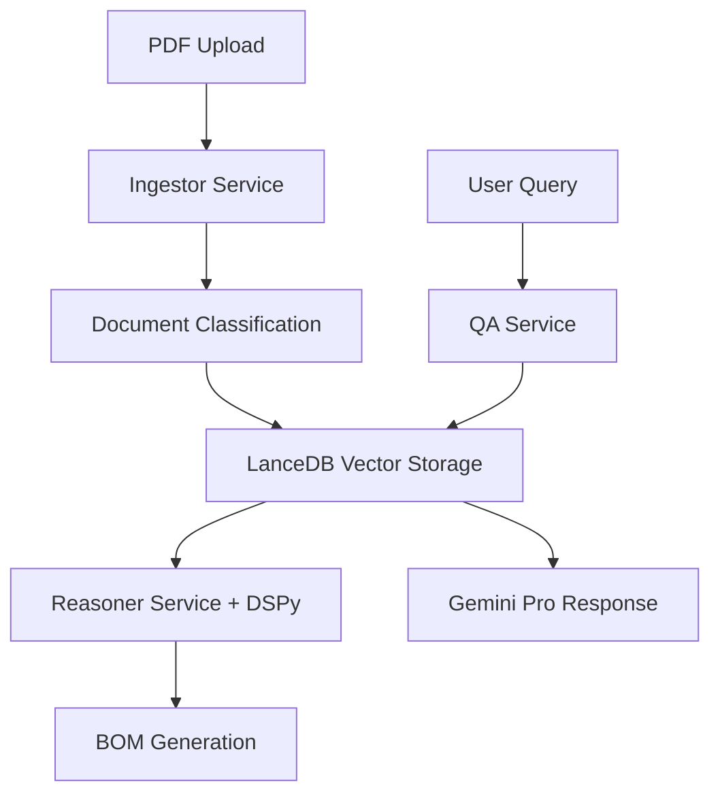

# Despiece-Bot: Sistema Multi-Agente para Construcción

## 🏗️ **Visión del Producto**

Sistema automatizado basado en LLMs y visión artificial que procesa PDFs complejos de proyectos de construcción para generar listados de materiales (quantity take-off) con mínimo esfuerzo humano.

## ⭐ **Características Principales**

- 🔍 **Procesamiento Inteligente de PDFs**: Hasta 1,000 páginas sin conversión a imágenes
- 🤖 **Sistema Multi-Agente**: Agentes especializados con CrewAI
- 📊 **Validación Numérica**: DSPy para cálculos precisos (>95% accuracy)
- ⚡ **Vector Search**: LanceDB para búsqueda 10x más rápida
- 🎯 **Generación de BOM**: Listados de materiales automáticos

## 🛠️ **Stack Tecnológico**

```yaml
# Core AI Stack
Backend: FastAPI + Python 3.11+ (Async)
LLM Engine: Gemini 2.5 Pro/Flash (Google GenAI SDK)
Multi-Agent: CrewAI 0.140.0
Validation: DSPy 2.6.27
Vector DB: LanceDB 0.8.2

# Infrastructure
Database: PostgreSQL 15 + Redis 7
Containerization: Docker + Docker Compose
Monitoring: Prometheus + Grafana
```

## 🚀 **Quick Start**

### Prerrequisitos
- Python 3.11+
- Docker & Docker Compose
- Git

### Instalación Local

```bash
# Clonar repositorio
git clone https://github.com/coagente/builder.git
cd builder

# Setup del entorno
make install

# Configurar variables de entorno
cp .env.example .env.local
# Editar .env.local con tus API keys

# Ejecutar en desarrollo
make dev
```

### Con Docker

```bash
# Construir y ejecutar
make build
make dev

# Ver logs
make logs

# Parar servicios
make clean
```

## 📚 **Documentación**

- [📋 TODO.md](./TODO.md) - Lista completa de tareas
- [📖 PRD.md](./PRD.md) - Especificación técnica completa
- [🏗️ docs/](./docs/) - Documentación detallada

## 🎯 **Roadmap**

### **MVP (4 semanas)**
- ✅ Setup inicial y Docker
- 🔄 Procesamiento de PDFs básico
- 🔄 Agentes CrewAI + DSPy validation
- 🔄 APIs REST completas

### **Production (12 semanas)**
- 🔄 Microservicios escalables
- 🔄 Seguridad y compliance
- 🔄 Monitoreo y observabilidad
- 🔄 CI/CD completo

## 📊 **Estado del Proyecto**

- **Fase Actual**: 0 - Setup Inicial
- **Progreso**: 🟡 En desarrollo
- **Próximo Milestone**: Infraestructura base

## 🤝 **Contribuir**

1. Fork el proyecto
2. Crear feature branch (`git checkout -b feature/nueva-funcionalidad`)
3. Commit cambios (`git commit -m 'Agregar nueva funcionalidad'`)
4. Push a la rama (`git push origin feature/nueva-funcionalidad`)
5. Abrir Pull Request

## 📄 **Licencia**

Este proyecto está bajo la Licencia MIT - ver [LICENSE](LICENSE) para detalles.

## 🌟 **Arquitectura**



---

**Versión**: 1.0 - Setup Inicial  
**Fecha**: Enero 2025  
**Mantenido por**: [Coagente](https://github.com/coagente)  
**Status**: 🚧 **EN DESARROLLO** 