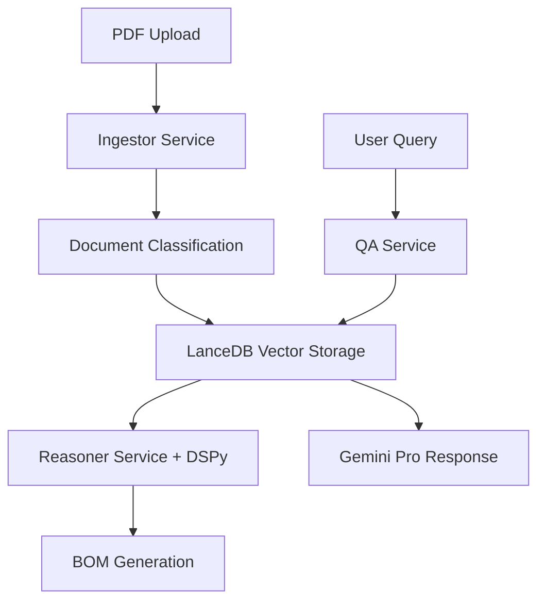

# Despiece-Bot: Sistema Multi-Agente para Construcción

## 🏗️ **Visión del Producto**

Sistema automatizado basado en LLMs y visión artificial que procesa PDFs complejos de proyectos de construcción para generar listados de materiales (quantity take-off) con mínimo esfuerzo humano.

## ⭐ **Características Principales**

- 🔍 **Procesamiento Inteligente de PDFs**: Hasta 1,000 páginas sin conversión a imágenes
- 🤖 **Sistema Multi-Agente**: Agentes especializados con CrewAI
- 📊 **Validación Numérica**: DSPy para cálculos precisos (>95% accuracy)
- ⚡ **Vector Search**: LanceDB para búsqueda 10x más rápida
- 🎯 **Generación de BOM**: Listados de materiales automáticos

## 🛠️ **Stack Tecnológico**

```yaml
# Core AI Stack
Backend: FastAPI + Python 3.11+ (Async)
LLM Engine: Gemini 2.5 Pro/Flash (Google GenAI SDK)
Multi-Agent: CrewAI 0.140.0
Validation: DSPy 2.6.27
Vector DB: LanceDB 0.8.2

# Infrastructure
Database: PostgreSQL 15 + Redis 7
Containerization: Docker + Docker Compose
Monitoring: Prometheus + Grafana
```

## 🚀 **Quick Start**

### Prerrequisitos
- Python 3.11+
- Docker & Docker Compose
- Git

### 🐳 **Instalación con Docker (Recomendado)**

```bash
# 1. Clonar repositorio
git clone https://github.com/coagente/builder.git
cd builder

# 2. Setup completo automático
make setup

# 3. Configurar API key de Google AI
cp env.example .env.local
# Editar .env.local: GOOGLE_AI_API_KEY=tu_api_key_aqui

# 4. Ejecutar en desarrollo
make dev
```

### 📡 **URLs de Desarrollo**
- **API**: http://localhost:8000
- **API Docs**: http://localhost:8000/docs  
- **Redis Admin**: http://localhost:8001
- **Health Check**: http://localhost:8000/health

### 🛠️ **Comandos Principales**

```bash
# Desarrollo
make dev              # Ejecutar con logs
make dev-detached    # Ejecutar en background
make health          # Verificar estado
make logs           # Ver logs

# Base de datos
make shell-db       # Acceso PostgreSQL
make shell-redis    # Acceso Redis CLI

# Control
make stop           # Parar servicios
make restart        # Reiniciar
make down          # Parar y limpiar
```

### 💻 **Instalación Local (Sin Docker)**

```bash
# Setup del entorno Python
make install-dev

# Configurar variables de entorno
cp env.example .env.local
# Configurar base de datos local y Redis

# Ejecutar tests
make test-fast
```

## 📚 **Documentación**

- [📋 TODO.md](./TODO.md) - Lista completa de tareas y progreso
- [📖 PRD.md](./PRD.md) - Especificación técnica completa  
- [🐳 README-DOCKER.md](./README-DOCKER.md) - Setup Docker detallado
- [🏗️ docs/](./docs/) - Documentación técnica adicional

## 🎯 **Roadmap**

### **MVP (4 semanas)**
- ✅ Setup inicial y Docker
- 🔄 Procesamiento de PDFs básico
- 🔄 Agentes CrewAI + DSPy validation
- 🔄 APIs REST completas

### **Production (12 semanas)**
- 🔄 Microservicios escalables
- 🔄 Seguridad y compliance
- 🔄 Monitoreo y observabilidad
- 🔄 CI/CD completo

## 📊 **Estado del Proyecto**

- **Fase Actual**: 1 - Infraestructura Base (Docker Completo)
- **Progreso**: 🔄 En desarrollo activo  
- **Completado**: ✅ Fase 0 + 🐳 Docker Stack completo
- **Próximo Milestone**: FastAPI + Base de datos

## 🤝 **Contribuir**

1. Fork el proyecto
2. Crear feature branch (`git checkout -b feature/nueva-funcionalidad`)
3. Commit cambios (`git commit -m 'Agregar nueva funcionalidad'`)
4. Push a la rama (`git push origin feature/nueva-funcionalidad`)
5. Abrir Pull Request

## 📄 **Licencia**

Este proyecto está bajo la Licencia MIT - ver [LICENSE](LICENSE) para detalles.

## 🌟 **Arquitectura**



---

**Versión**: 1.0 - Setup Inicial  
**Fecha**: Enero 2025  
**Mantenido por**: [Coagente](https://github.com/coagente)  
**Status**: 🚧 **EN DESARROLLO** 